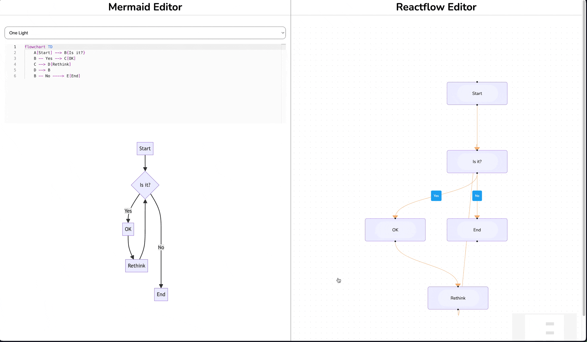

# mermaid to reactflow converver app

This simple application converts mermaid flow diagrams to reactflow diagrams.

> [!WARNING]  
> This is a work in progress and is not yet ready for production use.

## Preview

## Resources

- [Mermaid](https://mermaid.js.org/): Markdown-like script language for generating charts from text via javascript.
  - [Mermaid Live Editor](https://mermaid-js.github.io/mermaid-live-editor/): An online editor for creating mermaid diagrams.
  - [Mermaid Flowcharts](https://mermaid.js.org/syntax/flowchart.html): Documentation for creating flowcharts with mermaid.
  - [Mermaid to JSON Example](https://github.com/relliv/mermaidjs-to-json-example): An example of converting mermaid diagrams to JSON (*only typescript*).
- [ReactFlow](https://reactflow.dev/): A library for building node-based graphs.
- [Monaco Editor](https://microsoft.github.io/monaco-editor/): A browser-based code editor.